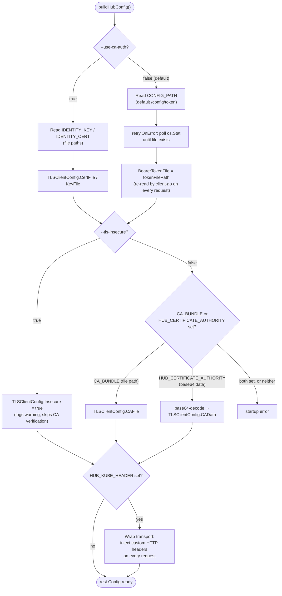
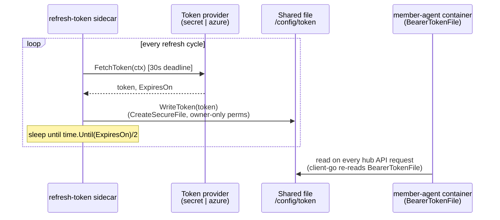

# Hub ↔ Member Cluster Authentication

This document is a deep dive into how a KubeFleet member agent authenticates to the hub cluster:
the credential modes, how credentials are minted and rotated, and how the hub authorizes an
authenticated identity once it connects. It is a companion to
[cluster-registration.md](cluster-registration.md), which covers the broader join/leave
lifecycle; see that document for the API types (`MemberCluster`, `InternalMemberCluster`) and
controllers referenced below.

## 1. The short version

KubeFleet does **not** implement a custom authentication protocol. The member agent's `hubMgr`
is just a `client-go` client pointed at the hub's API server; the hub's kube-apiserver
authenticates every request the normal Kubernetes way — `TokenReview` for a bearer token, or TLS
client-certificate verification against the apiserver's configured client CA. What KubeFleet
*does* own is:

- **Getting a valid credential onto the member-agent pod** in the first place, and keeping it
  fresh (§2–§3).
- **Authorizing** the resulting identity narrowly, once authenticated, via a per-cluster
  `Role`/`RoleBinding` the hub provisions (§4).

So "authentication" here really means two separate things: proving *who* the agent is
(Kubernetes' job), and constraining *what* that identity can touch (KubeFleet's job, via RBAC).

```mermaid
flowchart LR
    A["Member agent request<br/>to hub API server"] --> B{"Bearer token or<br/>client cert?"}
    B -->|token| C["kube-apiserver:<br/>TokenReview"]
    B -->|cert| D["kube-apiserver:<br/>verify against client CA"]
    C --> E["Authenticated as<br/>mc.Spec.Identity<br/>e.g. system:serviceaccount:...")"]
    D --> E
    E --> F["kube-apiserver: RBAC check<br/>against Role/RoleBinding<br/>in fleet-member-&lt;name&gt; namespace"]
    F -->|allowed| G["Request served"]
    F -->|denied| H["403 Forbidden"]
```

## 2. Client credential modes (`buildHubConfig()`)

File: `cmd/memberagent/main.go` (`buildHubConfig`), flags in `cmd/memberagent/options/hub.go`.

`buildHubConfig()` builds the one `*rest.Config` used for every hub request. Two mutually
exclusive **client identity** modes are selected by `--use-ca-auth`, plus independent settings
for how the agent verifies the *hub's* TLS identity.



### 2.1 Bearer token auth (default, `--use-ca-auth=false`)

This is the path used by the quickstart script and the default Helm chart (`useCAAuth: false`
in `values.yaml`).

- The member agent reads `CONFIG_PATH` (default `/config/token`), retries until that file
  exists, then sets `hubConfig.BearerTokenFile = tokenFilePath`.
- `client-go` re-reads the bearer-token file **on every outgoing request**, so credential
  rotation is fully transparent to the agent — no restart or config reload needed.
- The token file is populated by a **second container in the same pod**, `refresh-token`
  (`cmd/authtoken`), sharing an `emptyDir` volume named `provider-token` mounted at `/config` in
  both containers (`charts/member-agent/templates/deployment.yaml`).

### 2.2 Client-certificate auth (`--use-ca-auth=true`)

- The member agent reads `IDENTITY_KEY` / `IDENTITY_CERT` env vars (file paths to a client
  private key and certificate) and sets `hubConfig.TLSClientConfig.CertFile` /
  `TLSClientConfig.KeyFile`.
- There is no equivalent of the `refresh-token` sidecar for this mode — no in-repo rotation
  mechanism ships for certs; provisioning and renewing the client cert/key pair (and getting the
  hub apiserver to trust the issuing CA) is entirely an operator/external-PKI responsibility.
- The chart drops the `refresh-token` container and the `provider-token` volume entirely when
  `useCAAuth: true`, since nothing needs to write a token file.

### 2.3 Verifying the hub's identity (independent of client mode)

- `--tls-insecure` skips hub-certificate verification entirely — logs an explicit warning and
  should only be used for local/dev clusters (e.g. `kind`).
- Otherwise, CA material for verifying the hub's cert is required from exactly one of:
  - `CA_BUNDLE` — a file path to a CA bundle mounted into the pod, or
  - `HUB_CERTIFICATE_AUTHORITY` — base64-encoded CA data passed directly as an env var (what the
    quickstart script uses, extracted straight from the operator's kubeconfig).
  - Setting both, or setting `CA_BUNDLE` to an empty string, is a startup error.

### 2.4 Custom auth headers for fronting proxies

An optional `HUB_KUBE_HEADER` env var lets operators inject arbitrary HTTP headers (parsed as
MIME headers) into every request the agent sends to the hub, via a custom `http.RoundTripper`
(`httpclient.NewCustomHeadersRoundTripper`). This exists for deployments where an auth proxy or
API gateway sits in front of the hub apiserver and needs its own header-based signal in addition
to (or instead of) the bearer token/client cert.

## 3. Credential lifecycle: bootstrap and rotation

### 3.0 The `refresh-token` sidecar image

The `refresh-token` container runs the `cmd/authtoken` binary (Cobra CLI, subcommand `secret` or
`azure`, §3.2). It is built and shipped as its own image, separate from the member-agent image:

- **Image**: `ghcr.io/kubefleet-dev/kubefleet/refresh-token`, tag defaulting to the chart's
  `appVersion` (`charts/member-agent/values.yaml` → `refreshtoken.repository`/`tag`,
  `charts/member-agent/Chart.yaml`).
- **Dockerfile**: `docker/refresh-token.Dockerfile` — multi-stage build. The builder stage
  (`mcr.microsoft.com/oss/go/microsoft/golang:1.26.6-1`) compiles `cmd/authtoken/main.go` (plus
  `pkg/authtoken` and `pkg/utils/writefile`, the latter for the secure/owner-only file creation
  used when writing the token) with `CGO_ENABLED=1` and `GOEXPERIMENT=systemcrypto` (links
  against the target architecture's OpenSSL rather than cross-compiling, hence the emulated
  per-arch builder). The runtime stage is a pinned-digest
  `gcr.io/distroless/base:nonroot` image, running as non-root UID/GID `65532:65532` with
  entrypoint `/refreshtoken`.
- **Build target**: `make docker-build-refresh-token` (Makefile).

### 3.1 End-to-end sequence (token mode)

Nothing in KubeFleet automates *creating* the identity or its credential — that's a manual
operator step (or something external tooling would do) before the agent ever starts. RBAC
provisioning (the `Role`/`RoleBinding`, §4) happens independently, driven by the hub-side
`MemberCluster` controller as soon as the `MemberCluster` object is created.

```mermaid
sequenceDiagram
    actor Op as Operator
    participant Hub as Hub API server
    participant MC as MemberCluster controller<br/>(hub agent)
    participant MemberSec as Member cluster: Secret<br/>hub-kubeconfig-secret
    participant Sidecar as Pod: refresh-token container
    participant Agent as Pod: member-agent container

    Op->>Hub: create ServiceAccount<br/>fleet-system/&lt;name&gt;-hub-cluster-access
    Op->>Hub: create Secret (kubernetes.io/service-account-token)<br/>annotated to that SA
    Hub-->>Op: SA token minted into Secret.data.token

    Op->>Hub: create MemberCluster<br/>spec.identity = that ServiceAccount
    activate MC
    Hub-->>MC: watch event: MemberCluster created
    MC->>Hub: create namespace fleet-member-&lt;name&gt;
    MC->>Hub: create Role fleet-role-&lt;name&gt;
    MC->>Hub: create RoleBinding fleet-rolebinding-&lt;name&gt;<br/>subject = spec.identity
    MC->>Hub: create InternalMemberCluster (Spec.State=Join)
    MC->>Hub: set MemberCluster.Status.Conditions[ReadyToJoin]=True
    deactivate MC

    Op->>Hub: kubectl get secret ... -o jsonpath token
    Op->>MemberSec: create Secret with extracted token
    Op->>Sidecar: helm install member-agent<br/>(deploys pod with both containers)

    activate Sidecar
    Sidecar->>MemberSec: GET secret hub-kubeconfig-secret
    MemberSec-->>Sidecar: token bytes
    Sidecar->>Sidecar: write token to shared /config/token<br/>(emptyDir, owner-only perms)
    deactivate Sidecar

    activate Agent
    Agent->>Agent: poll os.Stat(/config/token) until it exists
    Agent->>Agent: hubConfig.BearerTokenFile = /config/token
    Agent->>Hub: authenticated request (Authorization: Bearer <token>)
    Hub->>Hub: TokenReview → identity =<br/>system:serviceaccount:fleet-system:&lt;name&gt;-hub-cluster-access
    Hub->>Hub: RBAC check against RoleBinding<br/>in fleet-member-&lt;name&gt; namespace
    Hub-->>Agent: 200 OK (request served)
    deactivate Agent
```

### 3.2 Ongoing token refresh (sidecar loop)

`pkg/authtoken/token_refresher.go` (`Refresher.RefreshToken`) runs this loop for the lifetime of
the pod. The refresh cadence is **half the token's remaining lifetime**
(`DefaultRefreshDurationFunc = time.Until(token.ExpiresOn) / 2`), a standard halfway-to-expiry
pattern; each fetch attempt is bounded by a 30s deadline, and a failed fetch is logged and
retried on the next tick rather than crashing the sidecar.



Two pluggable token providers (`cmd/authtoken/main.go`, `pkg/authtoken/providers/`):

| Provider | File | Behavior |
|---|---|---|
| `secret` (default) | `pkg/authtoken/providers/secret/k8s_secret.go` | Reads `.data.token` from a named `Secret` on the **member** cluster (`--name`/`--namespace`, defaulting to `hub-kubeconfig-secret`/`default`). This is a **static** credential — whatever long-lived `ServiceAccount` token the operator extracted from the hub and copied to the member cluster. Since a raw `kubernetes.io/service-account-token` `Secret` carries no expiry, the provider fabricates one (`ExpiresOn = now + 24h`) purely to pace the refresh loop; it re-reads the *same* secret every ~12h rather than minting anything new. |
| `azure` | `pkg/authtoken/providers/azure/azure_default_credential.go` | Uses `azidentity.NewDefaultAzureCredential`, which tries, in order, until one succeeds: `EnvironmentCredential` (service principal via env vars) → `WorkloadIdentityCredential` (federated credential, as injected by the Azure Workload Identity webhook) → `ManagedIdentityCredential` (IMDS, system-assigned) → `AzureCLICredential` (`az login`) → `AzureDeveloperCLICredential` (`azd auth login`). No client-ID flag/option exists — every legitimate way of steering the chain to a specific identity (the workload-identity webhook, an `EnvironmentCredential` Secret) already sets `AZURE_CLIENT_ID` itself, so a separate flag would only risk silently overriding whichever of those actually applies. `--scope` defaults to the AKS AAD scope with the required `/.default` suffix, `6dae42f8-4368-4678-94ff-3960e28e3630/.default` — the suffix is mandatory for the `EnvironmentCredential`/`WorkloadIdentityCredential` legs (their OAuth2/MSAL confidential-client flow rejects a bare resource ID with `AADSTS1002012`), while `ManagedIdentityCredential`'s IMDS calls strip it internally, so the same value works across every credential in the chain. This means the same image authenticates correctly under managed identity, workload identity federation, a service principal, or local `az`/`azd` sessions, without picking a mode up front. `ExpiresOn` is the real AAD token expiry, so refreshes happen at the token's actual halfway point. |

Net effect: **hub SA token (or Azure MSI token) → `refresh-token` sidecar → shared
`/config/token` file → member-agent main container's `BearerTokenFile`**, refreshed
indefinitely in the background with zero agent restarts.

## 4. Authorization: what an authenticated identity can actually do

Authenticating as `mc.Spec.Identity` only proves *who* the agent is. What that identity may *do*
on the hub is governed entirely by a `Role`/`RoleBinding` pair the hub-side `MemberCluster`
controller provisions in the member's own `fleet-member-<name>` namespace
(`pkg/controllers/membercluster/v1beta1/membercluster_controller.go`, `syncRole`/
`syncRoleBinding`):

- **`Role fleet-role-<name>`** grants full access (`verbs: ["*"]`), scoped to that one
  namespace, to:
  - `cluster.kubernetes-fleet.io` (i.e. `InternalMemberCluster`)
  - `placement.kubernetes-fleet.io` (i.e. `Work`/`AppliedWork`)
  - `networking.fleet.azure.com` (for networking agents)
  - plus `get/list/update/patch/watch/create` on core `events`.
- **`RoleBinding fleet-rolebinding-<name>`** binds `mc.Spec.Identity` to that `Role` (defaulting
  `APIGroup` to `rbac.authorization.k8s.io` for `User`/`Group` subjects with none set).

This is what actually enforces isolation between member clusters: two member agents
authenticating with two different `ServiceAccount` identities each get a `RoleBinding` that only
reaches their own namespace, so neither can read or modify the other's `InternalMemberCluster`,
`Work` objects, or the cluster-scoped `MemberCluster` object itself — even though both are, from
the hub apiserver's point of view, successfully authenticated clients. It's also why the API is
split into `MemberCluster` (cluster-scoped, hub-admin-owned) and `InternalMemberCluster`
(namespaced, member-agent-writable) in the first place — see
[cluster-registration.md §1.2](cluster-registration.md#12-internalmembercluster--internal-namespaced-mailbox).

## 5. Key file index

| Concern | File |
|---|---|
| Client credential assembly (`buildHubConfig`) | `cmd/memberagent/main.go` |
| Hub-auth flags (`--use-ca-auth`, `--tls-insecure`) | `cmd/memberagent/options/hub.go` |
| Token refresh CLI (`refreshtoken`) | `cmd/authtoken/main.go` |
| Token refresh loop | `pkg/authtoken/token_refresher.go` |
| Token file writer (secure file, owner-only perms) | `pkg/authtoken/token_writer.go` |
| Secret-based token provider | `pkg/authtoken/providers/secret/k8s_secret.go` |
| Azure `DefaultAzureCredential` token provider | `pkg/authtoken/providers/azure/azure_default_credential.go` |
| Member-agent Helm deployment (env vars, sidecar wiring) | `charts/member-agent/templates/deployment.yaml` |
| Member-agent Helm defaults | `charts/member-agent/values.yaml` |
| Manual quickstart bootstrap | `hack/quickstart/join-member-clusters.sh` |
| Role/RoleBinding provisioning (`syncRole`, `syncRoleBinding`) | `pkg/controllers/membercluster/v1beta1/membercluster_controller.go` |
| Namespace/Role/RoleBinding naming + RBAC rule definitions | `pkg/utils/common.go` |
